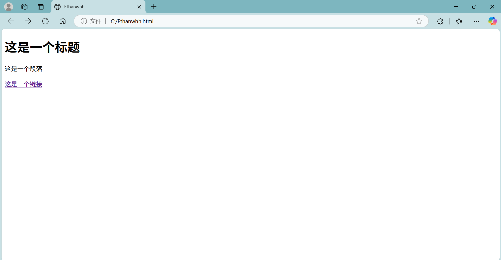

```

<!DOCTYPE html>
<html>

<head>
  <meta charset="utf-8">
  <title>Ethanwhh</title>
</head>

<body>

  <!--这是一个注释，注释在浏览器中不会显示-->

  <h1>这是一个标题</h1>

  <p>这是一个段落</p>
  
  <a href="https://www.baidu.com">这是一个链接</a>

</body>

</html>

```


