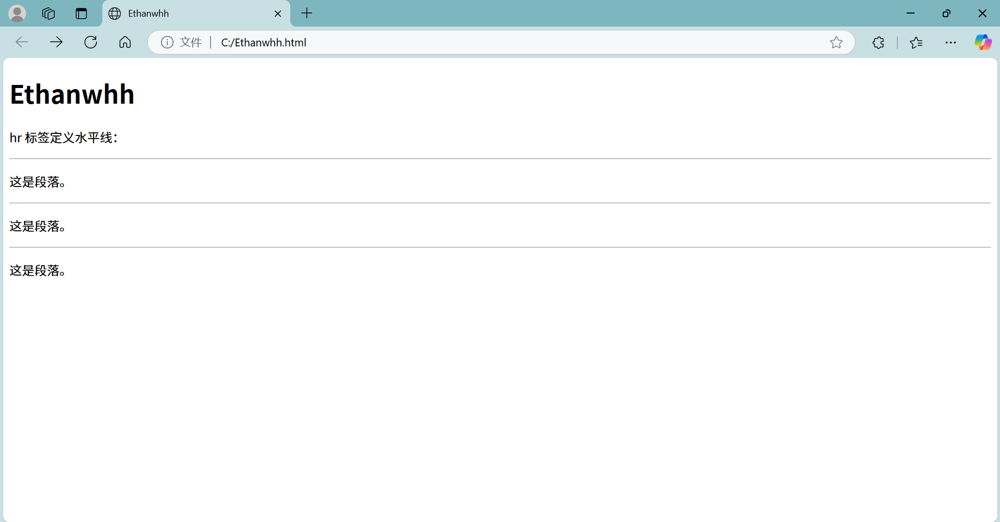

```

<!DOCTYPE html>
<html>

<head>
  <meta charset="utf-8">
  <title>Ethanwhh</title>
</head>

<body>
  <h1>Ethanwhh</h1>
 
  <p>hr 标签定义水平线：</p>
  <hr/>
  <p>这是段落。</p>
  <hr/>
  <p>这是段落。</p>
  <hr/>
  <p>这是段落。</p>
</body>

</html>

```


