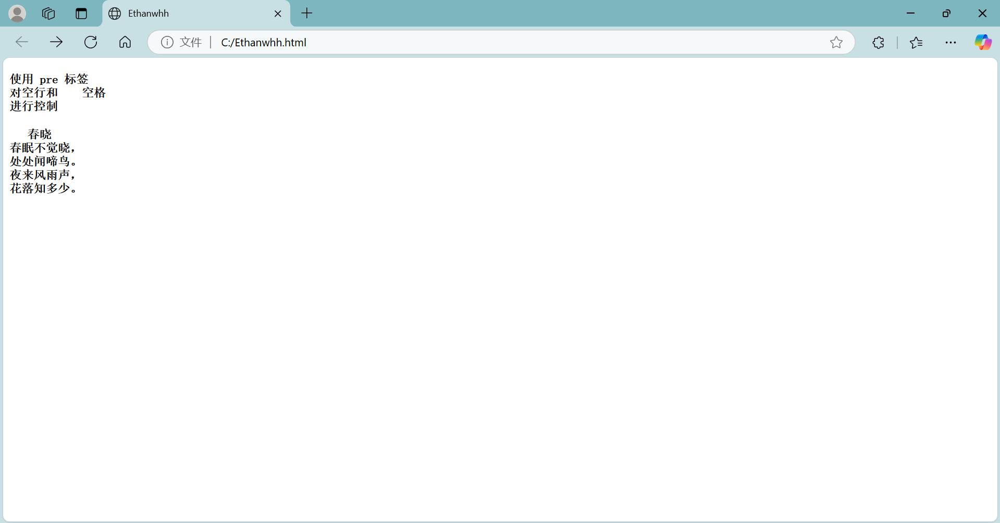

```

<!DOCTYPE html>
<html>

<head>
  <meta charset="utf-8">
  <title>Ethanwhh</title>
</head>

<body>

<h3>
<pre>
使用 pre 标签
对空行和    空格
进行控制
</pre>
</h3>

<h3>
<pre>
   春晓
春眠不觉晓，
处处闻啼鸟。
夜来风雨声，
花落知多少。
</pre>
</h3>


</body>

</html>

```


