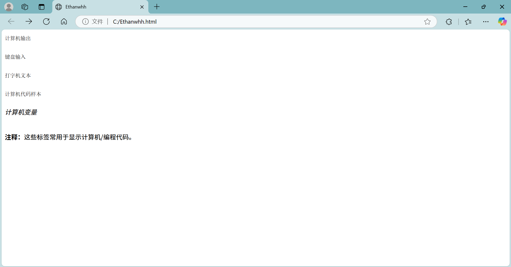

```

<!DOCTYPE html>
<html>

<head>
  <meta charset="utf-8">
  <title>Ethanwhh</title>
</head>

<body>

  <code>计算机输出</code>

  <br><br>

  <kbd>键盘输入</kbd>

  <br><br>

  <tt>打字机文本</tt>

  <br><br>

  <samp>计算机代码样本</samp>

  <br><br>

  <var>计算机变量</var>

  <br><br>

  <p>
    <b>注释：</b>这些标签常用于显示计算机/编程代码。
  </p>

</body>

</html>

```


